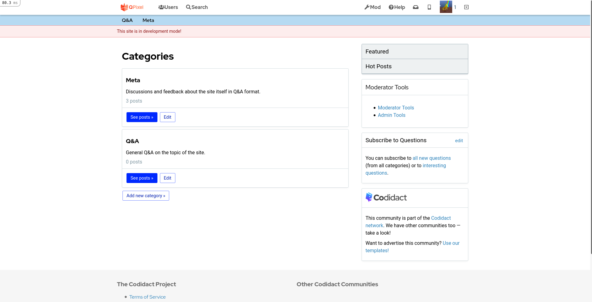
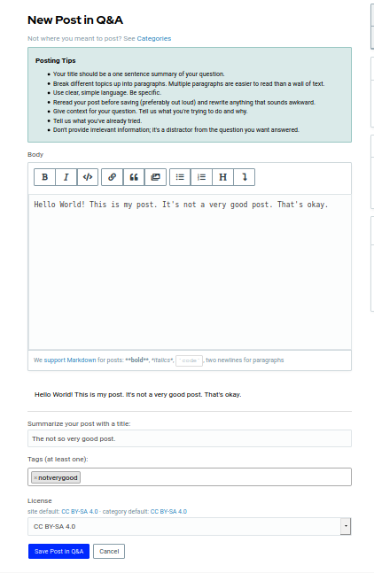
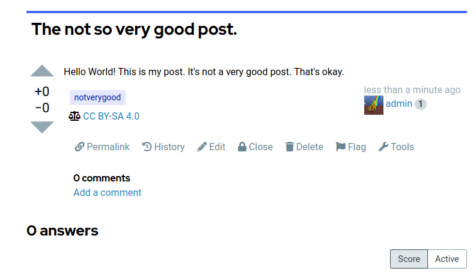

# QPixel [](https://circleci.com/gh/codidact/qpixel) [](https://coveralls.io/github/codidact/qpixel) [](https://zenodo.org/badge/latestdoi/237078806)
Rails-based version of our core software. Currently under active development towards MVP.

## Installation
These instructions are assuming you already have a Unix environment available with Ruby and Bundler installed.
WSL should work as well, but (core) Windows is unlikely to.

If you don't already have Ruby installed, use [RVM](https://rvm.io/) or
[rbenv](https://github.com/rbenv/rbenv#installation) to install it before following these instructions.

### Install prerequisites

For Debian-Based Linux:

```
sudo apt update
sudo apt install gcc
sudo apt install make
sudo apt install libmysqlclient-dev
sudo apt install autoconf bison build-essential libssl-dev libyaml-dev libreadline-dev zlib1g-dev libncurses5-dev libffi-dev libgdbm-dev
sudo apt install mysql-server
```

For Arch-Based Linux:

```
sudo pacman -Syyu
sudo pacman -Sy gcc
sudo pacman -Sy make
sudo pacman -Sy ruby autoconf bison base-devel ruby unixodbc wxgtk
sudo snap install mysql --beta Or, sudo pacman -S mysql
```

Install the following packages and unpack them: https://aur.archlinux.org/packages/libmysqlclient/

For Mac:

```
xcode-select --install
brew install mysql bison openssl mysql-client
bundle config --global build.mysql2 --with-opt-dir="$(brew --prefix openssl)"
```

## 1. Install JS runtime
If you already have Node.JS installed, you can skip this step. If not,
[download and install it](https://nodejs.org/en/download/).

## 2. Install Redis
If you haven't already got it, [download and install Redis](https://redis.io/download).

## 3. Install Imagemagick

If you haven't already installed Imagemagick, you'll need to [install it for
your system][0].

## 4. Download QPixel
Clone the repository and `cd` into the directory:

    git clone https://github.com/codidact/qpixel
    cd qpixel

## 5. Configure database connection
If you weren't asked to set the root MySQL user password during `mysql-server` installation, the installation is
likely to be using Unix authentication instead. You'll need to sign into the MySQL server with `sudo mysql -u root`
and create a new database user for QPixel:

```sql
CREATE USER qpixel@localhost IDENTIFIED BY 'choose_a_password_here';
GRANT ALL ON qpixel_dev.* TO qpixel@localhost;
GRANT ALL ON qpixel_test.* TO qpixel@localhost;
GRANT ALL ON qpixel.* TO qpixel@localhost;
```

Copy `config/database.sample.yml` to `config/database.yml` and fill in the correct host, username, and password for
your environment. If you've followed these instructions (i.e. you have installed MySQL locally), the correct host
is `localhost` or `127.0.0.1`.

You'll also need to fill in details for the Redis connection. If you've followed these instructions, the sample file
should already contain the correct values for you, but if you've customised your setup you'll need to correct them.

## 6. Set up QPixel
Install gems:

    bundle install

Set up the database:

    rails db:create
    rails db:schema:load
    rails r db/scripts/create_tags_path_view.rb
    rails db:migrate

 You'll need to create a Community record and purge the Rails cache before you can seed the database. In a Rails
 console (`rails c`), run:

```ruby
Community.create(name: 'Dev Community', host: 'localhost:3000')
Rails.cache.clear
```

## 7. Seed the database:

    $ rails db:seed
    Category: Created 2, skipped 0
    [...]

Run the server!

    rails s

## 8. Configure Categories

Before you try to create a post we need to configure categories! 
Go to `http://localhost:3000/categories/`



 Click "edit" for each category and scroll down to see the "Tag Set" field. This
 will be empty on first setup.


You will need to select a tag set for each category! For example, the Meta category can be
associated with the "Meta" tag set, and the Q&A category can be associated with "Main"


Make sure to click save for each one.<br> 
<em>Note:</em> You may need to run `rails db:seed` again.

## 8. Create a Post

You should then be able to create a post! There are character requirements for the
body and title, and you are required at least one tag.



And then click to "Save Post in Q&A"




You can create the first user account in the application, which should be running at `http://localhost:3000/`. To upgrade
the user account
to an admin account, run `rails c` for a console, followed by:

```ruby
User.last.update(confirmed_at: DateTime.now, is_global_admin: true)
```

## Install with Docker

See the README.md in the [docker](docker) folder for complete instructions.

## License
[AGPL licensed](https://github.com/codidact/qpixel/blob/master/LICENSE).

## Contributing
Contributions are welcome - please read the [CONTRIBUTING](https://github.com/codidact/qpixel/blob/develop/CONTRIBUTING.md)
document before you start and look at the [TODO list](https://github.com/codidact/qpixel/wiki/TODO-list) for things to do.


[0]: https://imagemagick.org/script/download.php
